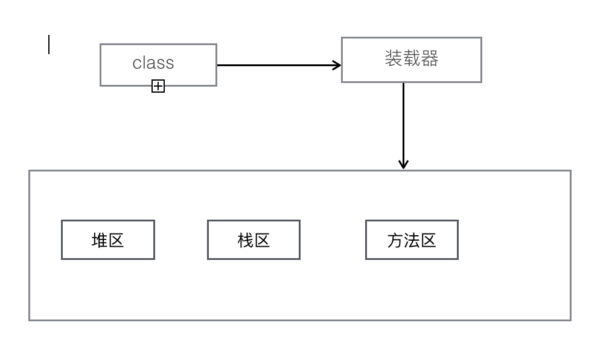

##Java虚拟机内存如下图1




* 堆区：存放`new`出来的**对象**，此时对象有垃圾收集器收集（垃圾收集器针对的就是堆区）。如果堆中对象没有更多的引用指向它，则改对象变成了垃圾，等待垃圾收集器回收。

* 栈区：每调用一个方法，会创建一个栈帧，存放方法的**局部变量**。

* 方法区：类的所有信息，包括所有的方法，**静态变量、常量**。

##程序执行过程中参数传递问题

1. 基本数据类型
2. 传递的数据是引用数据类型


* 基本数据类型

观察两个方法中i的输出情况

```java

public class TestDemo1 {
	public void m1(int i) {
		i++;
		System.out.println("m1---->" + i);
	}
	public static void main(String[] args) {
		int i = 10;
		m1(i);
		System.out.println("main---->" + i);
	}
}
```

运行结果：
>m1---->11
>main---->10

至于为什么会出现这样的结果，来看一张图片

 <https://github.com/UseJie/usejie.github.io/blob/master/img/Java%E5%9F%BA%E6%9C%AC%E6%95%B0%E6%8D%AE%E7%B1%BB%E5%9E%8B.png>

可以理解为main()中的i与m1()中i两个不同的数就可以了，可以将i理解成C语言中函数的形参。

* 传递的数据是引用数据类型

同样的，观察两个方法中i的输出情况

```java

public class TestDemo2 {
	public static void m1(Animal a) {
		a.age++;
		System.out.println("m1--->" + a.age);
	}
	public static void main(String[] args) {
		Animal a = new Animal(10);
		m1(a);
		System.out.println("main--->" + a.age);
	}
}

class Animal {
	int age;
	Animal(int i) {
		age = i;
	}
}
```

输出结果
>m1--->11
>main--->11

可以通过下图来理解输出的两个值为何相同


可以看出m1()和main()共享Animal中的数据。

##空指针
* 记`java.lang.NullpointerException` 空指针异常

造成的原因，如下例子:

```java

public class NullExceptionDemo {
	public static void main(String[] args) {
		star s = new star();
		s = null;
		s.song();
	}
}

class star {
	public void song() {

	}
}
```

编译会通过，但是在执行的时候会报错，错误提示：
>Exception in thread "main" java.lang.NullPointerException

这就是空指针异常

我们可以通过异常处理`try{}catch(){}`来捕获异常。在上述代码中进行修改

```java

public class NullExceptionDemo {
	public static void main(String[] args) {
		try{
			star s = new star();
			s = null;
			s.song();
			}catch(NullPointerException ex) {
				System.out.println("空指针异常");
			}
	}
}

class star {
	public void song() {

	}
}
```


异常处理会在后续总结。

>胆大心细！！!加油！！！